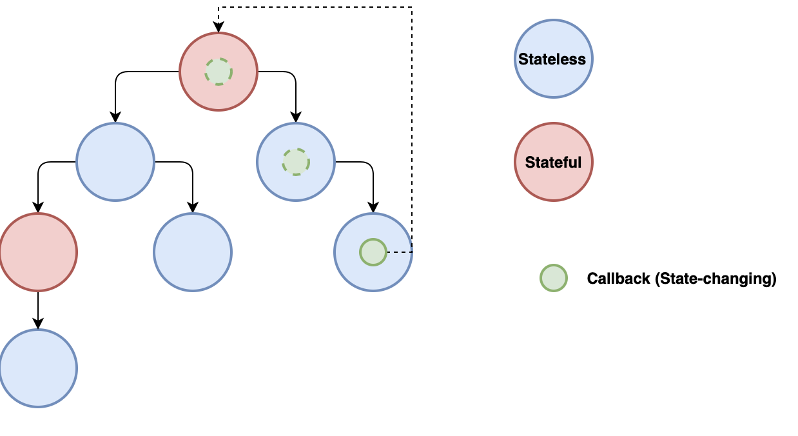
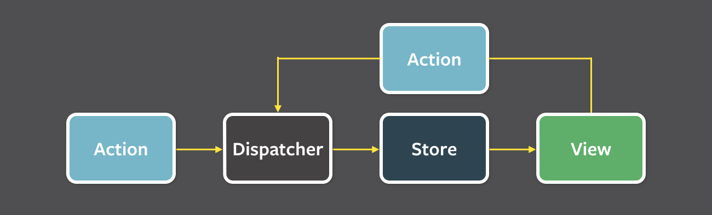

slidenumbers: true

# Coding Brunch: <br/>React & Redux

# Welcome! 👋

---

# Let's get started!

* WiFi
	* `cc-guest`  /  `MoinHamburg!`
* Food
* Introduction
* Agenda

---

# Agenda

* React crash course
* Break
* Redux introduction
* Walkthrough of our application
* Coding: Let's implement new features! 👨‍💻👩‍💻 
* 15:00 Closing

---

# React

## Why React?

* fast SPAs
* separation of concerns (the view of M**V**C)
* build large, maintainable frontends
* ...just a library!

^choose what you need: view library + state handling

^maintainable: composable components, declarative, simple, easy to reason about

---

## Core concepts

* components (composability)
* unidirectional dataflow
* virtual DOM

^small/visible part of UI (button), can have a state, receives (immutable) input, renders itself

^dataflow: no data binding, state only changed in a few places (top), keep data flow simple, on state change whole app re-renders

^native DOM was never meant for dynamic UIs. details...

---

## Virtual DOM

* diff two versions of DOM tree efficiently
* batch updates
* update only subtrees


^goal is: minimize DOM operations as they are costly

---

# A Component has...

* presentation
* static/immutable characteristics (`props`)
* changeable characteristics (`state`)
* a lifecycle

---

# Let's build one! 🎉

* multiple ways of defining a component
* JSX
* use a function or a class

<br/>
We'll see some examples now! 

Feel free to try them out yourself:
`https://bit.ly/2Pug6UA`

---

# Defining a component 
## With a `function`

^function pros: simple, the view as (composable) function, testable (input + output)

^function cons: no state, no lifecycle hooks (`componentDidMount`)

```jsx
const HelloWorld = function() {
  return (<p>Hello world!</p>)
}

const HelloWorld2 = () => {
	<p>Hello world!</p>
}
```
---

# Defining a component 
## With a `class`

```jsx
class HelloWorld extends React.Component {
  constructor(props) {
    super(props)
  }
  
  render() { 
	  return <h1>HelloWorld</h1> 
  }
}
```

^pros: ES6 class, allows state handling, all lifecycle hooks are supported

^cons: slightly heavier / clumsier

--- 

# JSX
## the simplest component

```jsx
const HelloWorld = () => {
  return <span>Hello world!</span>
}

<HelloWorld />
```

---

# JSX
## define and use components alongside Javascript

```jsx
const howIsIt = "awesome"
const nameFn = () => "Foo"

const Greeting = () => (
  <p>
    Hello {howIsIt} World: {nameFn()}
  </p>
)
```

---

# JSX
## conditions (as ternary expressions)

```jsx
const isWorld = false

const Greeting = () => (
  <p>
    Hello {isWorld ? <p>World</p> : Universe}!
  </p>
)
```

---

# JSX
## lists

```jsx
const items = ["First", "Second", "Third"]
const listEntries = items.map((e, idx) =>
  <li key={idx}>
    {e}
  </li>
)
const List = () => <ul>{listEntries}</ul>
```

^components of the same type in a list need a unique key for subelements

---

# props

* for passing (immutable) data to components
* examples: `color`, `size`, `handleClick`
* Components must never modify their own props (use state instead)

^pure function that gets input and produces markup as output

---

# props

```jsx
const Button = ({title, color = "red" }) => (
	<button>{title}</button>
)

const Menu = () => (
    <div>
        <Button title="Click me" color="blue" />
        <Button title="Or click me" />
    </div>
)
```

^DOM properties: camelCased (`className` for `class`, `htmlFor` for `for`)

^ PropTypes for validation

---

# state

* mutable state of component
* examples: user input, application data
* initial state can be set in constructor
* outside of constructor: `setState`

---

# state

```jsx
class Button extends React.Component {
  constructor(props) {
    super(props)
    this.state = {clicked: false}
  }

  getStyle = () => ({color: this.state.clicked ? 'green' : 'red'})

  render() {    
    return (
        <button style={this.getStyle()}>click me</button>
    )
  }
}
```

---

# Event handling

* similar to handling events on native DOM
* camelCase
* function is passed as event handler
* `preventDefault()`

---

# Event handling

```jsx
class Button extends React.Component {
  constructor(props) {
    super(props)
    this.state = {clicked: false}
  }

  onClick = () => this.setState({clicked: !this.state.clicked})

  getStyle = () => ({color: this.state.clicked ? 'green' : 'red'})

  render() {    
    return (
        <button onClick={this.onClick}
                style={this.getStyle()}>click me</button>
    )
  }
}
```

---

# Communication between components
## Parent -> Child

* React app is a tree of components🎄
* Components may have `props` and `state`
* Application state is pushed down the hierarchy:

```
const Welcome = (props) => 
	<h1>Hello, {props.name}</h1>
	
const MainComponent = () => 
	<Welcome name="Chris" />
```

^easy to reason about state
one/very few source of truth
efficient rendering

---

# Communication between components
## Child -> Parent

* communication to parent
* can be done with event handlers
	* callbacks are passed down + invoked by child



^event handler has to be passed through component hierarchy
 
---

# Communication between components
## Child -> Parent

```jsx
const Welcome = (props) => 
  <p onClick={ () => props.onClickHandler("Hi") }>
    Hello, {props.name}
  </p>

const MainComponent = () => {
  const saySomething = (something) => {
    console.log(something)
  }
  return <Welcome onClickHandler={saySomething} name="Chris"  />
}
```

---

# Communication between components
## Container components

* good practice: split up components into:
	* container component (behaviour)
	* component (presentation)
* we'll look at an example later

^container: how things **work**
may contain state
no to little presentation markup

^UI component: how things **look**
mostly functions, no state

---

# Break. ☕ 🥣 

## Up next: Redux

---

# Redux
## Why?

* `state`, `props` and event handlers are fine for small apps but don't scale well
* data flow becomes difficult to comprehend
* we need a clear pattern

---

# Redux
## Flux to the rescue

* pattern for managing data flow in applications
* unidirectional
* clear responsibilities
* independent from view library (React)

---

# Redux
## Flux - The moving parts



Redux is one implementation of this pattern. Its parts are slightly different.

---

# Redux
## 3 principles

1. the whole application state is stored in a single **store**.
2. the only way to change **state** is to emit an **action**.
3. to specify how the **state** is transformed by **actions**, you write pure **reducers**.

---

# Redux
## Action

* internal API
* describe that something happened in your application
* object with a `type` and a payload

```js
const myAction = {
    type:'SET_NAME',
    name:'Foo'
}
```

---

# Redux
## Reducer

* pure function that describes how your application's **state** changes in response to an **action**
* every **reducer** receives every **action** (but doesn't have to handle it)
* usually a `switch`/`case`
* returns changed **state** as new object

---

# Redux
## Reducer

```js
const reducer = (previousState, action) => {   
    switch (action.type) {
        case 'SET_NAME': {
            const newState {
                ...previousState,
                name: action.name
            }

            return newState
        }
    }
}
```

---

# Redux
## Store

* holds application **state** (object tree)


```js
{ gender: 'male', name: 'Chris' }
```
* brings **actions** and **reducers** together

```js
const store = createStore(reducers)

// retrieve state:
store.getState()

// dispatch an action to reducers:
store.dispatch(action)

// register listeners:
store.subscribe(listener)
```

---

# Putting everything together


---

# Let's get started! 🤩

## Clone and build the skeleton app

```bash
git clone https://gitlab.codecentric.de/react-codingbrunch/inventory-frontend.git

cd inventory-frontend

git checkout walking_skeleton

npm install
```

### Run the app: `npm start`
### Run the tests: `npm test`

---

# Thanks for coming! 👋

## We hope to see you next time 🙂

It would be awesome if you could give us some feedback:
 `https://bit.ly/2Prdtmj`
 
 <br />
 `https://www.meetup.com/Coding-Brunch`
 